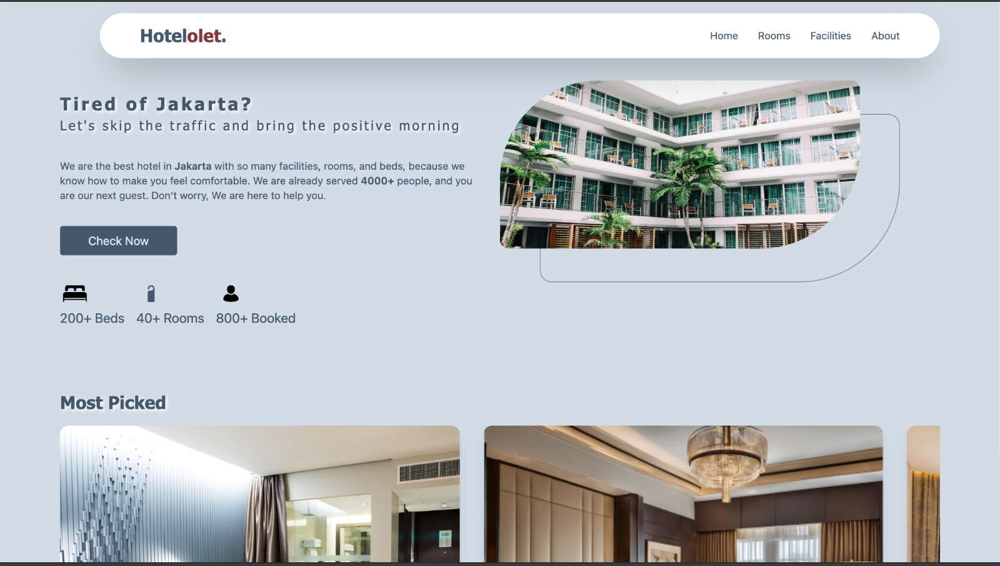
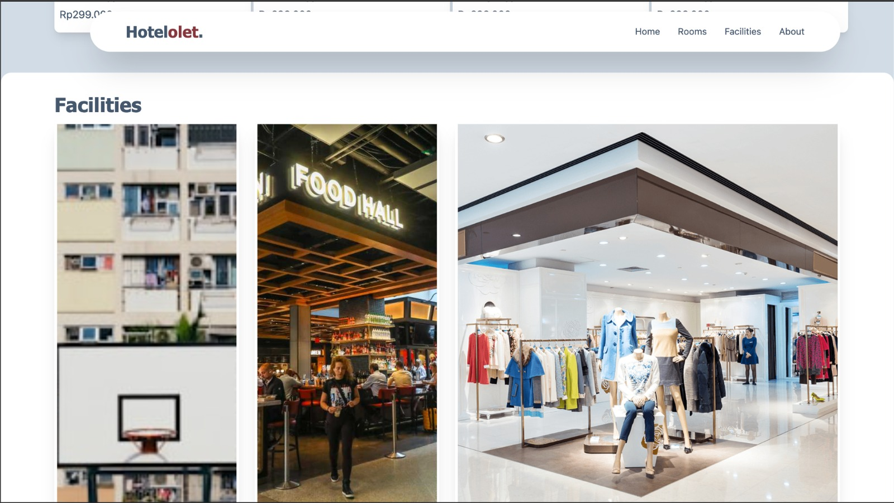
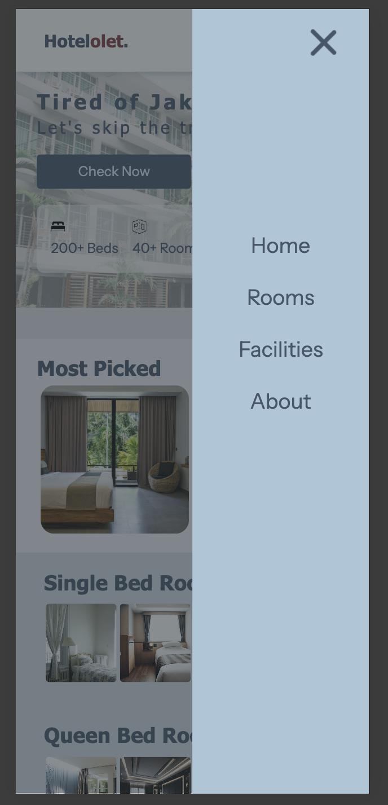

# Welcome to Hotelolet!

Hotelolet is a company profile website for it's hotel.


link: https://septalonika.github.io/revou-module-2/index.html

> _"The idea is to make a website that is simple, clean, and easy to use."_

<details> <summary>Checkpoint #1</summary>
 
1. Applying custom font using @font-face or embed

```html
<link rel="preconnect" href="https://fonts.googleapis.com" />
<link rel="preconnect" href="https://fonts.gstatic.com" crossorigin />
<link
  href="https://fonts.googleapis.com/css2?family=Instrument+Sans:ital,wght@0,400..700;1,400..700&display=swap"
  rel="stylesheet"
/>
```

```css
:root {
  --background-color: #d2dce6;
  --primary: #192524;
  --secondary: #d1ebdb;
  --font-family: "Instrument Sans", sans-serif;
  --font-color: #44576d;
}

html {
  font-family: var(--font-family);
}
```

###

2. Applying text-shadow to text and list-style to the list

> text-shadow

```css
.text-shadow {
  text-shadow: 2px 2px 4px #ffffff;
}
```

I'm using `text-shadow` property in the most heading tag, for the example About Us Heading in the page of about.html to make it more clear


3. Applying 1 responsive background image, (using contain or cover, suit your needs)

```html
<div
  class="relative h-80 w-60 rounded-xl shadow-lg md:h-[30vh] md:w-[56vw] lg:h-[58vh] lg:w-[40vw]"
>
  

  <div class="absolute bottom-0 left-0 w-full rounded-b-xl bg-white">
    <div
      class="flex h-16 flex-col justify-center p-2 md:h-24 md:px-4 md:text-xl lg:text-lg"
    >
      <p>Double-1 Bed Room</p>
      <p>Rp299.000</p>
    </div>
  </div>
</div>
```


4. Applying 1 responsive image with picture + source + srcset method

```html
<picture>
  <source
    media="(max-width: 600px)"
    srcset="./src/assets/images/hero-hotel-small.jpg 1x"
    type="image/jpeg"
  />
  <source
    media="(max-width: 1200px)"
    srcset="./src/assets/images/hero-hotel-medium.jpg 1x"
    type="image/jpeg"
  />
  <source
    media="(min-width: 1201px)"
    srcset="./src/assets/images/hero-hotel-large.jpg 1x"
    type="image/jpeg"
  />
  
</picture>
```

I'm using 3 different pictures to handling 3 different viewports such

5. Creating one Asymmetrical Grid → layouting grid, both container and item (children)

<details> <summary>Code</summary>

```html
<div class="grid w-full grid-cols-4 grid-rows-5 lg:gap-6">
  <div class="hoverimg row-span-2 grid object-center p-1 shadow-xl">
    
  </div>
  <div
    class="hoverimg col-span-1 grid items-center justify-center p-1 shadow-xl"
  >
    
  </div>
  <div
    class="hoverimg col-span-2 grid items-center justify-center p-1 shadow-xl"
  >
    
  </div>

  <div class="hoverimg grid items-center justify-center p-1 shadow-xl">
    
  </div>
  <div class="hoverimg grid items-center justify-center p-1 shadow-xl">
    
  </div>
  <div class="hoverimg grid items-center justify-center p-1 shadow-xl">
    
  </div>
  <div class="hoverimg grid items-center justify-center p-1 shadow-xl">
    
  </div>
  <div class="hoverimg grid items-center justify-center p-1 shadow-xl">
    
  </div>
  <div
    class="hoverimg col-span-2 row-span-2 grid items-center justify-center p-1 shadow-xl"
  >
    
  </div>
  <div
    class="hoverimg col-span-2 grid items-center justify-center p-1 shadow-xl"
  >
    
  </div>
  <div
    class="hoverimg col-span-2 grid items-center justify-center p-1 shadow-xl"
  >
    
  </div>
  <div class="hoverimg grid items-center justify-center p-1 shadow-xl">
    
  </div>
  <div class="hoverimg grid items-center justify-center p-1 shadow-xl">
    
  </div>
</div>
```

</details>

###


###

6. Creating simple animation with two methods: animation and transition

```css
.hovertrue:hover {
  cursor: pointer;
  transform: scale(1.2);
}

.hoverimg:hover {
  box-shadow: 0 0 10px 0 #9cabb4;
  cursor: pointer;
  transform: scale(1.01);
}

.typewriter {
  overflow: hidden;
  white-space: nowrap;
  margin: 0 auto;
  letter-spacing: 0.15em;
  animation:
    typing 1s steps(40, end),
    blink-caret 0.75s step-end infinite;
}

/* The typing effect */
@keyframes typing {
  from {
    width: 0;
  }
  to {
    width: 100%;
  }
}

.slide-in-right {
  animation: slideInRight 1s ease-out;
}

@keyframes slideInRight {
  from {
    transform: translateX(100%);
  }
  to {
    transform: translateX(0);
  }
}

@keyframes fadeIn {
  from {
    opacity: 0;
  }
  to {
    opacity: 1;
  }
}

@keyframes slideInLeft {
  from {
    transform: translateX(-100%);
  }
}
.slide-in-left {
  animation: slideInLeft 1s ease-out;
}

.fade-in-image {
  animation: fadeIn 1s ease-in-out;
}

.fade-in-bottom {
  animation: fadeInBottom 0.5s ease-out;
}

@keyframes fadeInBottom {
  from {
    opacity: 0;
    transform: translateY(20px);
  }
  to {
    opacity: 1;
    transform: translateY(0);
  }
}
```


###

> list-style

```html
<article>
  <p>We may collect personal information from you when you:</p>
  <ul class="list-disc px-4">
    <li>Make a reservation or inquiry</li>
    <li>Check-in or check-out</li>
    <li>Use our services and facilities</li>
    <li>Participate in surveys or promotions</li>
  </ul>
  <p>The types of personal data we may collect include:</p>
  <ul class="list-disc px-4">
    <li>Name</li>
    <li>Contact information (email address, phone number)</li>
    <li>Payment information</li>
    <li>Preferences and feedback</li>
    <li>Any other information you provide to us</li>
  </ul>
</article>
```

I'm using list-disc to give a styling for my list on Privacy Page

</details>

### Styling

```html
<script src="https://cdn.tailwindcss.com"></script>
<link rel="stylesheet" href="./dist/output.css" />
```

> I put the css in the head tag because it's the first thing that will be loaded when the page is loaded.
> I'm using both cdn embed and from the output.css to prevent tailwindcss from error

---

<details> <summary>Favicon</summary>

```html
<link
  rel="apple-touch-icon"
  sizes="57x57"
  href="./public/icons/apple-icon-57x57.png"
/>
<link
  rel="apple-touch-icon"
  sizes="60x60"
  href="./public/icons/apple-icon-60x60.png"
/>
<link
  rel="apple-touch-icon"
  sizes="72x72"
  href="./public/icons/apple-icon-72x72.png"
/>
<link
  rel="apple-touch-icon"
  sizes="76x76"
  href="./public/icons/apple-icon-76x76.png"
/>
<link
  rel="apple-touch-icon"
  sizes="114x114"
  href="./public/icons/apple-icon-114x114.png"
/>
<link
  rel="apple-touch-icon"
  sizes="120x120"
  href="./public/icons/apple-icon-120x120.png"
/>
<link
  rel="apple-touch-icon"
  sizes="144x144"
  href="./public/icons/apple-icon-144x144.png"
/>
<link
  rel="apple-touch-icon"
  sizes="152x152"
  href="./public/icons/apple-icon-152x152.png"
/>
<link
  rel="apple-touch-icon"
  sizes="180x180"
  href="./public/icons/apple-icon-180x180.png"
/>
<link
  rel="icon"
  type="image/png"
  sizes="192x192"
  href="./public/icons/android-icon-192x192.png"
/>
<link
  rel="icon"
  type="image/png"
  sizes="32x32"
  href="./public/icons/favicon-32x32.png"
/>
<link
  rel="icon"
  type="image/png"
  sizes="96x96"
  href="./public/icons/favicon-96x96.png"
/>
<link
  rel="icon"
  type="image/png"
  sizes="16x16"
  href="./public/icons/favicon-16x16.png"
/>
<link rel="preconnect" href="https://fonts.googleapis.com" />
<link rel="preconnect" href="https://fonts.gstatic.com" crossorigin />
<link
  href="https://fonts.googleapis.com/css2?family=Instrument+Sans:ital,wght@0,400..700;1,400..700&display=swap"
  rel="stylesheet"
/>
<meta name="msapplication-TileColor" content="#ffffff" />
<meta name="msapplication-TileImage" content="/ms-icon-144x144.png" />
```

</details>

###

> This is the hotelolet favicon which will be shown in the browser tab.

---

###

## Header

```html
<
<header class="header slide-in-left">
  <nav class="nav">
    <div class="header-left">
      <a class="company-logo text-bold" href="/hotelolet/index.html">
        <h2>Hotel<span>olet</span>.</h2>
      </a>
    </div>
    <div class="header-right">
      <div class="nav-items">
        <a href="#">
          <p>Home</p>
        </a>
        <a href="/hotelolet/index.html#rooms">
          <p>Rooms</p>
        </a>
        <a href="/hotelolet/index.html#facilities">
          <p>Facilities</p>
        </a>
        <a href="/hotelolet/src/pages/about.html">
          <p>About</p>
        </a>
      </div>
      <div class="burger-btn">
        <span></span>
        <span></span>
        <span></span>
      </div>
      <div class="burger-menu">
        <div class="burger-menu-list">
          <a href="#">
            <div>
              <p>Home</p>
            </div>
          </a>
          <a href="/hotelolet/index.html#rooms">
            <p>Rooms</p>
          </a>
          <a href="/hotelolet/index.html#facilities">
            <p>Facilities</p>
          </a>
          <a href="/hotelolet/src/pages/about.html">
            <p>About</p>
          </a>
        </div>
      </div>
      <div class="burger-menu-outer"></div>
    </div>
  </nav>
</header>
```

### Applied Sticky Nav Header

```html
<header
  class="fade-in-bottom sticky top-0 z-20 w-screen flex-col rounded-none bg-[#ffffff] shadow-2xl lg:left-[10vw] lg:top-[2vh] lg:w-[84vw] lg:rounded-[10vw]"
></header>
```

Regarding the Criterias of the Checkpoint need it to use sticky for the Nav Header, so I set the position of my Nav Header as `position: sticky`.

I'm using the `nav` tag to create the navigation bar and the `div` tag to create the logo placeholder and the title and the navigation menu.

For the `a` tag, I'm using the `class` attribute to create the navigation tab and the `href` attribute to create the navigation link, so that when the user clicks on the navigation tab, it will navigate to the section of the page with the id of the navigation tab.

There are 4 navigation I included here, which are:

1. Home

---

Home is to get back to the index.html file which is the root .

### Nav Logo

```html
<a class="company-logo text-bold hovertrue" href="./index.html">
  <h2>Hotel<span>olet</span>.</h2>
</a>
```

### Nav Header

```html
<a class="hovertrue" href="./index.html">
  <p>Home</p>
</a>
```

### Burger Menu

```html
<a href="./index.html">
  <div>
    <p class="text-xl md:text-3xl">Home</p>
  </div>
</a>
```

---

###

2. Rooms

---

Rooms will brings you to the section of Rooms which still inside of the root file. This section will show the information about all of the rooms that Hotelolet has.

### Nav Header

```html
<a class="hovertrue" href="./index.html#rooms">
  <p>Rooms</p>
</a>
```

### Burger Menu

```html
<a href="./index.html#rooms">
  <p class="text-xl md:text-3xl">Rooms</p>
</a>
```

---

###

3. Facilties

---

Facilties will brings you to the section of Facilties which still inside of the root files. This section will show the information about all of the facilties that Hotelolet has.

### Nav Header

```html
<a href="../index.html#facilities">
  <p>Facilities</p>
</a>
```

### Burger Menu

```html
<a href="../index.html#facilities">
  <p class="text-xl md:text-3xl">Facilities</p>
</a>
```

---

###

4. About
   If you click this, it will redirect you to About page which is about.html. It will show you what is Hotelolet about, and also all the reviews of hotelolet from some users.

### Nav Header

```html
<a href="./about.html">
  <p class="text-xl md:text-3xl">About</p>
</a>
```

### Burger Menu

```html
<a href="./pages/about.html">
  <p>About</p>
</a>
```

I'm using the `display` property to create the navigation bar and the `position` property to create the fixed navigation bar at the top of the page.

###

---

---

###

there is 3 section in the main tag, the first section is the `welcome` section, the second section is the `facilities` section, and the third section is the `booking` section.

each section has a unique id so that when the user clicks on the navigation tab, it will navigate to the section of the page with the id of the navigation tab.

### Welcome Section

---


this is the welcome section of the page, it's the first thing that will be shown when the page is loaded.

###

```html
<section id="welcome" class="flex h-full w-screen flex-col"></section>
```

### Rooms Section


### Facilities Section



---

###

This is the facilities section of the page, it's the second thing that will be shown when the page is loaded. There are 3 facilities that will be shown in this section, the first facility is the rooms, the second facility is the dining, and the third facility is the events.

```html
<section
  id="facilities"
  class="slide-in-right mb-[4vh] mt-[8vh] flex w-screen flex-col gap-4"
>
  <div class="flex flex-col gap-8">
    <div
      class="flex flex-col gap-2 rounded-2xl bg-[#ffffff] px-[6vw] py-[2vh] lg:py-[4vh]"
    >
      <h2 class="text-2xl font-semibold md:text-3xl">Facilities</h2>
      <div class="flex">
        <div class="grid w-full grid-cols-4 grid-rows-5 lg:gap-6"></div>
      </div>
    </div>
  </div>
</section>
```

I'm using the `grid grid-cols-4 grid-rows-5` class to create the grid layout for the facilities section, so that the facilities section will be displayed in a 4 column layout with 5 rows so that the task to build asymetric grid will be done.

---

## Footer


at the end of the page, I'm using the `footer` tag to create the footer of the page.
it's a simple footer that includes a copyright text.

###

---

# about.html


This is the page that shows about the Hotelolet. Not only about the hotelolet, this will shows you also the review of the users


# booked.html


This is the booking section of the page, it's the third thing that will be shown when the page is loaded. This section is the form for the user to book a room.

There is 5 input in the booking section, the first input is the check-in date, the second input is the check-out date, the third input is the room type, the fourth input is the extra bed, and the fifth input is the special request.

So for this section, I'm using the `form` tag to create the form for the user to book a room.

```html
<form
  name="booking-form"
  id="booking-form"
  class="flex flex-col"
  action="/hotelolet/src/pages/success.html"
  method="GET"
  target="_blank"
></form>
```

Methods GET is used because this project is a simple project that only use static html and css.

target="\_blank" is used because the form will submit the form to the other page.

I set action to the form to the path of the booked.html page so that when the user submits the form, it will navigate to the booked.html page.

The form includes a submit button that will submit the form to the booked.html page.

The input type I used are `text` for common text input, `date` for the check-in and check-out date, `radio` for the room type, `checkbox` for the extra bed, and `textarea` for the special request.

Below will help to generate image based on what their click

```js
const queryString = window.location.search;

const urlParams = new URLSearchParams(queryString);

const paramValue = urlParams.get("room");

console.log(paramValue);

const imgElement = document.getElementById("dynamicImg");

imgElement.src = `/hotelolet/src/assets/images/${paramValue}.jpg`;

const roomName = document.getElementById("roomName");

roomName.value = paramValue;
```

# success.html


This page will show after users submit the form, and will show the name and email that already been submitted. For make it happens, i'm using below javascript simple code to generated that.

```js
const queryString = window.location.search;

const urlParams = new URLSearchParams(queryString);

const name = urlParams.get("name");

const roomName = urlParams.get("roomName");

const email = urlParams.get("email");

const successText = document.getElementById("success-text");
successText.textContent = `hi ${name}, you have booked ${roomName} room, we have sent you an email to ${email}, thank you!`;
```

# career.html


This should be show the career opportunity.

Because this only demo, I don't have an enough time to generate this page well, so I only put sample information.

# privacy.html


This should be show the Privacy and Policy.

Because this only demo, I don't have an enough time to generate this page well, so I only put sample information.

# tnc.html


This should be show the terms and conditions.

Because this only demo, I don't have an enough time to generate this page well, so I only put sample information.

# CSS

For CSS I created some of the general css which I use often to help me define a styling for some element which is will using it for the remain time. Here are the CSS:

```css
.flex {
  display: flex;
}

.flex-col {
  flex-direction: column;
}

.justify-center {
  justify-content: center;
}

.items-center {
  align-items: center;
}

.w-screen {
  width: 100vw;
}

.w-full {
  width: 100%;
}

.h-screen {
  height: 100vh;
}

.h-full {
  height: 100%;
}

.grid {
  display: grid;
}

.rounded-2xl {
  border-radius: 1rem; /* 16px */
}

.grid-template-rows-2 {
  grid-template-rows: 1fr 1fr;
}

.grid-template-columns-2 {
  grid-template-columns: 1fr 1fr;
}

.px-1 {
  padding-left: 1vw;
  padding-right: 1vw;
}

.carousel-lists {
  display: grid;
  grid-template-columns: 1fr 1fr 1fr 1fr;
}

.carousel-items {
  display: flex;
  height: 20vh;
  justify-content: center;
  padding: 4vh 0;
}

.carousel-img {
  width: 20vw;
  object-fit: cover;
  object-position: center;
  border-radius: 1vw;
}
```

## Animation

Here are the lists of animation effect that I'm using for Hotelolet

###

Slide in from left effect

```css
.slide-in-left {
  animation: slideInLeft 1s ease-out;
}

@keyframes slideInLeft {
  from {
    transform: translateX(-100%);
  }
}
```

Slide in from right effect

```css
.slide-in-right {
  animation: slideInRight 1s ease-out;
}

@keyframes slideInRight {
  from {
    transform: translateX(100%);
  }
  to {
    transform: translateX(0);
  }
}
```

Slide From Top Effect

````css
@keyframes slideFromTop {
  from {
    transform: translateY(-20px);
    opacity: 0;
  }
  to {
    transform: translateY(0);
    opacity: 1;
  }
}

.animate-from-top {
  animation: slideFromTop 1s ease-out forwards;
}
``` Typewritter Effect ```css .typewriter {
  overflow: hidden;
  white-space: nowrap;
  margin: 0 auto;
  letter-spacing: 0.15em;
  animation:
    typing 1s steps(40, end),
    blink-caret 0.75s step-end infinite;
}

@keyframes typing {
  from {
    width: 0;
  }
  to {
    width: 100%;
  }
}
````

Fade in Effect (Just Shows Up)

```css
@keyframes fadeIn {
  from {
    opacity: 0;
  }
  to {
    opacity: 1;
  }
}

.fade-in-image {
  animation: fadeIn 1s ease-in-out;
}
```

Fade-in Effect from bottom

```css
.fade-in-bottom {
  animation: fadeInBottom 0.5s ease-out;
}

@keyframes fadeInBottom {
  from {
    opacity: 0;
    transform: translateY(20px);
  }
  to {
    opacity: 1;
    transform: translateY(0);
  }
}
```

## Flex to Centered the contents

I'm using Flex to centering some elements, one of all the example is below

```html
<a href="/hotelolet/src/pages/booked.html?room=luxury2" class="carousel-items">
  
</a>
```

```css
.carousel-items {
  display: flex;
  height: 10vh;
  justify-content: center;
  padding: 1vh 0;
}
```

## CSS Grid Samples

I'm using Grid for some elements, one of all the example is below

```html
<div class="traveler-review">
  
  <div class="traveler-article">
    <p></p>
    
  </div>
</div>
```

```css
.traveler-review {
  display: grid;
  grid-template-columns: 1fr 2fr;
  justify-content: center;
  gap: 4vw;
}

.traveler-article {
  padding-right: 12vw;
  height: auto;
}
```

I'm using grid to set 2 sides which already fixed for 2 contents,`1fr` code for the left side contents which are the images placeholder, and `2fr` as the bigger one uses as the article review of the users.

## CSS Responsive

I only make Phone size and Desktop size for this matter because I busy working, I apologize for that.

the css for the responsives :

```css
@media (max-width: 641px) {
  /* portrait tablets, portrait iPad, landscape e-readers, landscape 800x480 or 854x480 phones */
  .header {
    width: 100vw;
    border-radius: 0;
    top: 0;
  }
  .nav {
    border-radius: 0;
    padding: 0 8vw;
  }
  .nav-items {
    display: none;
  }
  .burger-btn {
    display: flex;
  }

  .hero-container {
    display: flex;
    height: 30vh;
    flex-direction: column;
    background-color: #e6e6e690;
  }

  .carousel-items {
    display: flex;
    height: 10vh;
    justify-content: center;
    padding: 1vh 0;
  }

  .hero-img {
    position: absolute;
    z-index: -1;
    top: 8vh;
    left: 0;
    width: 100%;
    height: auto;
    border-radius: 0;
    object-fit: contain;
  }

  .hero-shadow {
    display: none;
  }

  .hero-left {
    display: flex;
    flex-direction: column;
    gap: 2vh;
  }

  .hero-content {
    display: none;
  }
  .hero-info-container {
    background-color: #ffffff90;
    padding: 4vw;
    border-radius: 2vw;
  }

  .hero-info-img {
    width: 4vw;
    height: 2vh;
  }

  .wrapper {
    display: flex;
    flex-direction: column;
    min-height: 30.3vh; /* Ensure wrapper takes at least full viewport height */
  }

  .footer-detail {
    flex-direction: column;
  }

  .footer-form-container {
    width: 60vw;
  }
  .email-subscribe {
    height: 4vh;
    right: 30vw;
  }

  .footer-form-container .textInput {
    padding: 1vh 21vw 1vh 1vw;
  }

  .container-form {
    padding: 10vh 8vw;
  }

  .container {
    padding: 2vh 6vw;
  }

  .padding-top-12 {
    padding: 0;
  }

  .traveler-container {
    display: flex;
    flex-direction: column;
    align-items: center;
    justify-content: center;
    padding: 2vh 0 2vh;
  }

  .traveler-img {
    width: 26vw;
    justify-self: end;
    border-radius: 2vw;
  }

  .traveler-review {
    display: grid;
    grid-template-columns: 1fr 2fr;
    justify-content: center;
    gap: 4vw;
  }

  .traveler-article {
    padding-right: 12vw;
    height: auto;
  }

  .quotes-container {
    display: none;
  }

  .book-site {
    flex-direction: column;
  }
  .extra-book {
    align-items: start;
  }
  .book-site-width {
    width: 100%;
    margin: 0;
    padding: 2vh 0;
  }

  .dynamicImg {
    width: 70vw;
    object-position: center;
    object-fit: contain;
    border-radius: 20px;
  }

  .container article p {
    text-align: justify;
  }
}

@media (min-width: 1200px) {
  /* hi-res laptops and desktops */
  .footer-form-container .textInput {
    padding: 1vh 7vw 1vh 1vw;
  }
  .burger-menu {
    display: none;
  }
  .burger-menu-outer {
    display: none;
  }
}
```

> I'm using the below of 641 pixels size width as the based for Tablets and Phone View, and 1200 up for the Desktop View

The javascript for hamburger button :

```js
const burgerBtn = document.getElementsByClassName("burger-btn")[0];
const burgerMenu = document.getElementsByClassName("burger-menu")[0];
const burgerMenuOuter = document.getElementsByClassName("burger-menu-outer")[0];

burgerMenuOuter.addEventListener("click", () => {
  burgerBtn.classList.toggle("active");
  burgerMenu.classList.toggle("active");
  burgerMenuOuter.classList.toggle("active");
});

burgerBtn.addEventListener("click", () => {
  burgerBtn.classList.toggle("active");
  burgerMenu.classList.toggle("active");
  burgerMenuOuter.classList.toggle("active");
});
```

### Home - Mobile View


### Burger Navigation

I created a Mobile burger navigation and helped by javascript to implemented how it's worked.



### Footer - Mobile View


### Booking - Mobile View


### Success - Mobile View


### About Us - Mobile View


### Career - Mobile View


### Privacy - Mobile View


### Terms and Conditions - Mobile View


